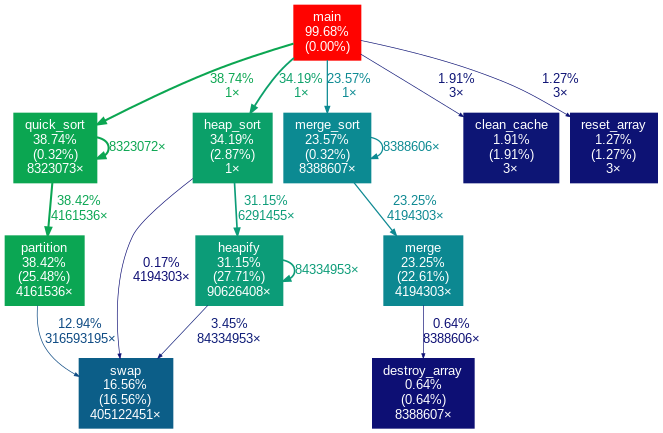

# optimized-codes

Repositório destinado aos códigos e atividades da disciplina **SSC0951 - Desenvolvimento de Código Otimizado**.

> **Profa. Dra. Sarita Mazzini Bruschi**

## Atividades
1. [Planejamento de Experimentos](#planejamento-de-experimentos)
2. [Perfilamento de Algoritmos (Pt.1)](#perfilamento-de-algoritmos-pt1)
3. [Perfilamento de Algoritmos (Pt.2)](#perfilamento-de-algoritmos-pt2)
4. [Otimizações pelo Compilador](#otimizações-pelo-compilador)
5. [Práticas de Otimização em Python](#práticas-de-otimização-em-python)
6. [Vetorização](#vetorização)

### Planejamento de Experimentos

Nesta atividade, foi desenvolvido em R um experimento fatorial completo ($2^3$) utilizando o pacote **FrF2**, com o objetivo de analisar como três fatores — modo, alcance e velocidade — influenciam o tempo médio de resposta do sistema. Foram calculados os efeitos principais e de interação, construídas as estatísticas relevantes (médias, desvios e gráficos de Pareto), e interpretado o impacto relativo de cada fator sobre a variabilidade observada.

A atividade representou meu primeiro contato formal com **Planejamento e Análise de Experimentos (DOE)**, permitindo consolidar conceitos como aleatorização, replicação, contrastes e interpretação de efeitos.

> O código referente à atividade encontra-se em `/01_experiments`.

### Perfilamento de Algoritmos (Pt.1)

Esta atividade consistiu em utilizar a ferramenta **perf**, um perfilador por amostragem do Linux, para coletar métricas relacionadas a branching e acesso à cache durante a execução de um programa de multiplicação de matrizes. O algoritmo foi implementado em quatro versões: **Naive**, **Interchange**, **Unrolling** e **Tiling**, permitindo observar como diferentes estratégias de organização de loops afetam o comportamento do hardware.

As métricas coletadas com o perf foram posteriormente analisadas em R, com o objetivo de investigar a influência entre os contadores de desempenho e identificar padrões que relacionam as otimizações aplicadas e o custo computacional resultante.

> O código referente à atividade encontra-se em `/02_matrix_multiplication`.

### Perfilamento de Algoritmos (Pt.2)

A terceira atividade consistiu em utilizar a ferramenta **gprof**, um perfilador por instrumentação do Linux, para coletar métricas de tempo e de chamadas de funções. Para isso, foi codificado um programa que implementa diferentes algoritmos de ordenação, como **Quick Sort**, **Merge Sort** e **Heap Sort**. Os resultados obtidos foram posteriormente analisados utilizando uma ferramenta gráfica que transforma a saída do perfilador em um grafo de fluxo de execução do programa, evidenciando os gargalos do programa.

> O código referente à atividade encontra-se em `/03_sorting_analysis`.

### Otimizações pelo Compilador

Nesta atividade, empregou-se diferentes diretivas de compilação para dois algoritmos de famosos de benchmark: **fannkuch-redux** e **n-body**, ambos retirados do [site do CLBG](https://benchmarksgame-team.pages.debian.net/benchmarksgame/). As flags de compilação utilizadas na análise foram **-O0**, **-O1**, **-O2**, **-O3** e **-Os**, e foram coletadas métricas de tempo de execução, tempo de compilação e tamanho do binário gerado.

> O código referente à atividade encontra-se em `/04_compiler_flags`.

### Práticas de Otimização em Python

A quinta atividade consistiu em aplicar técnicas de perfilamento e otimização de acesso à cache em Python, além de explorar o uso de bibliotecas altamente otimizadas. Para isso, foram utilizados os módulos **cProfile** e **timeit** para medir o desempenho e identificar gargalos nos códigos. Avaliou-se também o impacto do decorador **@lru_cache**, do módulo **functools**, em algoritmos de busca em grafos, especialmente no caso do A*, cujo cálculo repetido da heurística é adequado para memoização. Por fim, comparou-se o desempenho da multiplicação de matrizes implementada em Python puro com a versão otimizada oferecida pela biblioteca **NumPy**, evidenciando os ganhos proporcionados por operações vetorizadas e rotinas de baixo nível.

> O código referente à atividade encontra-se em `/05_python_optimization`.

### Vetorização

A sexta atividade envolveu a vetorização de um kernel computacional utilizando **intrínsecos**, comparando uma implementação escalar com uma versão vetorizada aplicada a um filtro Gaussiano 2D. O código foi compilado com diferentes configurações, permitindo medir separadamente o impacto das otimizações automáticas do compilador e da vetorização manual. Os resultados demonstraram como o uso de SIMD pode acelerar o processamento dependendo do nível de otimização já aplicado pelo compilador.

> O código referente à atividade encontra-se em `/06_vectorization`.